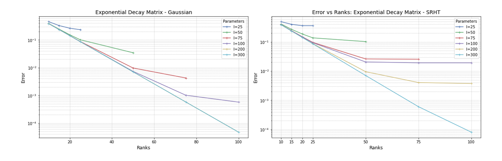
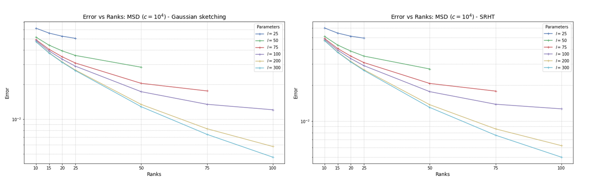
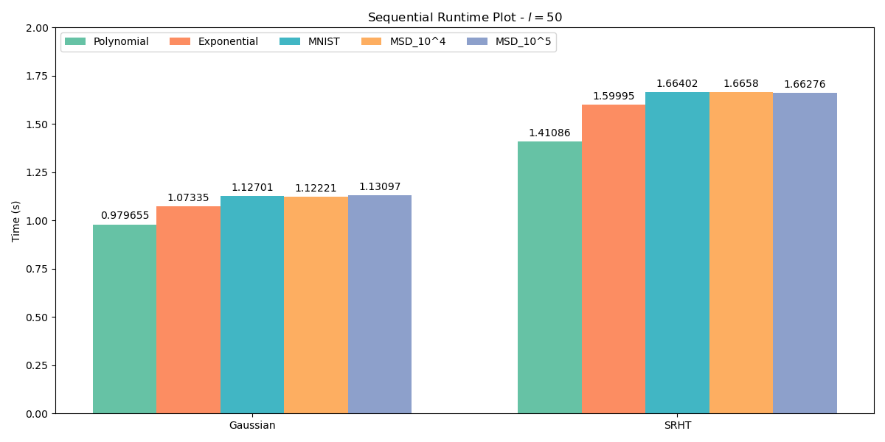
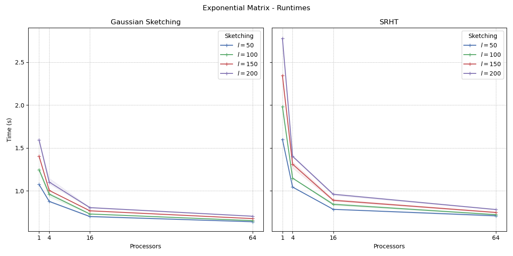
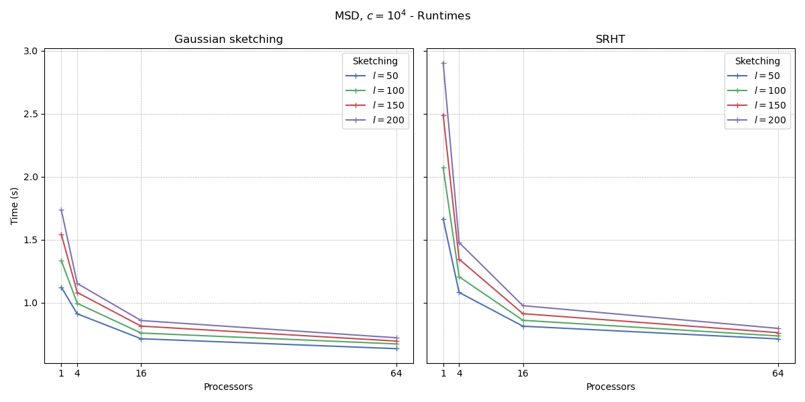
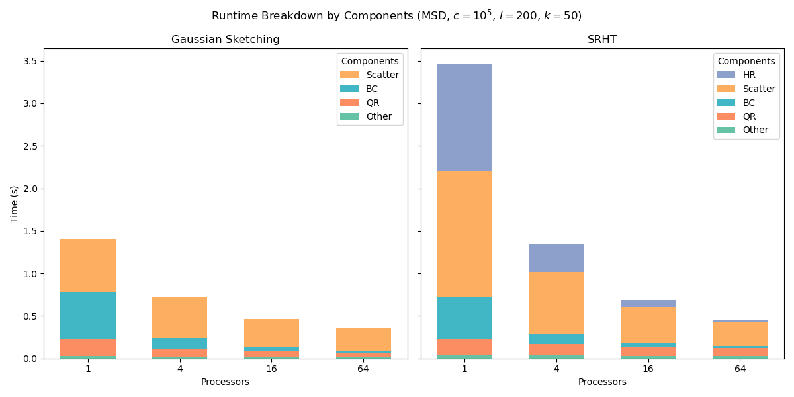

# Randomized Nyström Low Rank Approximation

## Description

The repository aims to implement the Randomized Nyström Low Rank Approximation method in python for a matrix $A \in \mathbb{R}^{n\times n}$, using Gaussian or SRHT sketching. It contains the files for Project 2, course MATH-505 "HPC for numerical methods and data analysis", Fall 2024, EPFL.   
Project and Repository developed and curated by [Tommaso Bozzi](https://github.com/TomBoez) and [Michele Lanfranconi](https://github.com/MikyLanfra).

## Table of Contents

- [Installation and Usage](#installation-and-usage)
- [Matrices](#matrices)
- [Results](#results)
- [Bibliography](#bibliography)

## Installation and Usage

To install the project locally, please run the following commands:

```bash
git clone https://github.com/your-username/your-repo-name.git
cd your-repo-name
pip install -r requirements.txt
```

The functions reproducing the code can be found in the `Utils` folder, and the code can be run locally as follows:

```bash
mpiexec -n 4 python Utils/random_nystrom.py
```

## Matrices

The matrices are created according to the instructions in the [Project_Instructions.pdf](Project_Instructions.pdf) file, generated as in [matrix_generation.py](Utils/matrix_generation.py).
In order to run the file it is necessary to download the matrices `mnist.mat` and `YearPredictionMSD.bz2` from the [LIBSVM Data website](https://www.csie.ntu.edu.tw/~cjlin/libsvmtools/datasets/) as per Project Instructions, store them in a folder and add the path to the [config file](Utils/config.json) in `matrix_input_path`. It is also possible to choose the location where to generate the matrices used for the algorithm as `matrix_output_path`.


## Results

This section provides a brief exploration of the main results, obtained by running the code on the `Helvetios Cluster` at EPFL.

### Stability Analysis
A first set of results is given by the stability analysis of the method, obtained by analyzing the nuclear norm   
$\|A\|_* = \sigma_1(A)+...+ \sigma_n(A)$   
of the difference between $A$ and its low-rank approximation $\llbracket A_{nyst} \rrbracket$ given by the algorithm:   
$Error = \|A- \llbracket A_{nyst} \rrbracket\|_* / \|A\|_*$

The following plots show the expected behaviour of an exponential decrease in error as we increase the low-rank dimension, while also showing the importance of the sketching in the algorithm, alongside the choice of sketching dimension.



### Sequential Runtimes
The plot compares the average runtime of the algorithm on the 5 matrices as described by the project description, for both choices of sketching matrices with sketching dimension $l=50$.


### Parallel Runtimes
This section shows the scaling in runtime as we increase the number of processors, while also showing a slight difference associated with different sketching dimensions.



### Runtimes Breakdown
This section describes in more detail how each part of the algorithm affects the overall runtime:
- Hadamard Transform (only for SHRT)
- Creation of $\Omega$ and Scatter of $A$
- Creation of $B$ and $C$
- TSQR algorithm
- Other - SVD of B and R and sequential matrix multiplications



## Bibliography

- Tropp, J. A., Yurtsever, A., Udell, M., & Cevher, V. (2017). [Fixed-Rank Approximation of a Positive-Semidefinite Matrix from Streaming Data](https://arxiv.org/abs/1706.05736). *arXiv preprint*, arXiv:1706.05736.

- Balabanov, O., Beaupere, M., Grigori, L., & Lederer, V. (2023). [Block Subsampled Randomized Hadamard Transform for Low-Rank Approximation on Distributed Architectures](https://arxiv.org/abs/2210.11295). *ICML'23: Proceedings of the 40th International Conference on Machine Learning*, 66, 1564–1576.

- LeCun, Y., Bottou, L., Bengio, Y., & Haffner, P. (1998). [Gradient-based learning applied to document recognition](https://ieeexplore.ieee.org/document/726791). *Proceedings of the IEEE*, 86(11), 2278–2324. MNIST database available at [http://yann.lecun.com/exdb/mnist/](http://yann.lecun.com/exdb/mnist/).

- Bertin-Mahieux, T. (2011). [Year Prediction MSD [Dataset]](https://doi.org/10.24432/C50K61). *UCI Machine Learning Repository*. Accessed from UCI Machine Learning Repository.

- Boutsidis, C., & Gittens, A. (2013). [Improved Matrix Algorithms via the Subsampled Randomized Hadamard Transform](https://doi.org/10.1137/120874540). *SIAM Journal on Matrix Analysis and Applications*, 34(3), 1301–1340.
